# 轻如烟系统架构全景图

> 生成日期：2026-06-27  
> 基于：README · openclaw.json · system-config/ · MIGRATION_PLAN.md · sandglass_source/ · agent-scheduler/ · inject-helper.mjs · docker/  
> 用途：完整理解"轻如烟"系统各组件的关系、数据流、运行时拓扑

---

## 1. 项目整体结构

```
轻如烟/ (Light Smoke — 便携身份包)
│
├── README.md                     ← 📖 自动生成的自述（含部署工作流、失忆诊断、配置差异对比）
├── SOUL.md / IDENTITY.md         ← 🤖 AI 灵魂与身份定义
├── USER.md / MEMORY.md           ← 👤 人类用户元数据 + AI 长期记忆
├── TOOLS.md / AGENTS.md          ← 🔧 工具笔记 + 代理行为协议
├── HEARTBEAT.md                  ← 💓 后台心跳检查清单
├── 🌫️-摸摸协议.md                ← 🔮 仪式协议（摸打包、情绪确认等）
├── 可复制.md                     ← 📋 复制/迁移指引
├── editor-config.json            ← ⚙️ 编辑器配置（路径/端口/环境差异）
├── VERSION                       ← 🔖 版本号追踪
│
├── memory/                       ← 🧠 AI 记忆存储
│   ├── YYYY-MM-DD.md             ←   每日轮感/日志
│   ├── facts.dict.md              ←   断言索引（L/S/M/T/R/B/D/N 系列）
│   ├── facts-archive.md           ←   断言归档
│   ├── backlog.md                 ←   待办事项
│   ├── captures.md                ←   捕获/留存片段
│   └── ...                        ←   其他记忆文件
│
├── system-config/                ← ⚙️ 系统配置存档（新机器还原用）
│   ├── openclaw.json             ←   Gateway 完整配置（模型/hooks/插件/MCP）
│   ├── cron-jobs.json            ←   定时任务定义
│   ├── skills/                   ←   Agent Skills
│   │   ├── digestion-cycle/      ←   🔄 消化循环（断言提取/冲突检测）
│   │   ├── 模块迁移清单/         ←   🧩 模型迁移验证
│   │   ├── 系统恢复协议/         ←   🔧 断线恢复五步法
│   │   └── 逐层追问法/           ←   🔍 根因排查方法论
│   ├── hooks/                    ←   Workspace Hooks
│   │   └── pre-compact-memory/   ←   💾 压缩前持久化 hook
│   └── plugins/                  ←   Gateway 行为插件
│       └── 轻如烟-行为强制/      ←   📖 before_prompt_build 上下文注入
│
├── scripts/                      ← 🛠️ 编辑器 + 工具脚本
│   ├── edit-web.py               ←   HTTP 编辑器（端口18888，~3925行）
│   ├── inject-helper.mjs         ←   通用 WS 注入助手（自动发现配置）
│   ├── searxng_mcp.py            ←   SearXNG 搜索 MCP Server
│   ├── embed-server.mjs          ←   本地向量嵌入服务
│   ├── momo-pack-cli.py          ←   摸摸打包 CLI
│   ├── task_dispatcher.py        ←   任务分发器
│   ├── sandglass_log_wrapper.py  ←   沙漏日志包装
│   ├── session_safety.py         ←   会话安全守卫
│   ├── health-check.sh           ←   健康检查脚本
│   ├── health-loop.sh            ←   健康循环
│   ├── start-health-loop.sh      ←   启动健康循环
│   ├── start-clean.sh            ←   启动清理
│   ├── watchdog.sh               ←   看门狗脚本
│   ├── cache_monitor.py          ←   缓存监控
│   ├── cache_stats_helper.py     ←   缓存统计
│   ├── think_patches.py          ←   思考补丁
│   ├── think_patterns.py         ←   思维模式
│   ├── think_test.py             ←   思维测试
│   ├── think_type_check.py       ←   思维类型检查
│   ├── reflection_unified.py     ←   统一反思
│   ├── deploy-notes/             ←   部署分析文档
│   │   └── *.md                  ←   各类审计/诊断/设计文档
│   ├── handlers/                 ←   HTTP 业务处理层（迁移中）
│   │   ├── router.py             ←   路由分发（52+ 条路由）
│   │   ├── inject_handler.py     ←   注入/编辑/重启/中止
│   │   ├── session_handler.py    ←   会话 CRUD/截断/备份
│   │   ├── crypto_handler.py     ←   加解密操作
│   │   ├── file_handler.py       ←   文件浏览/CRUD
│   │   ├── momo_handler.py       ←   摸摸打包/状态/搜索
│   │   ├── system_handler.py     ←   系统状态/健康/缓存
│   │   ├── helper_handler.py     ←   辅助/工具函数
│   │   └── awake_handler.py      ←   守夜题库/发送/脉冲
│   ├── utils/                    ←   工具函数层
│   │   ├── config.py             ←   配置发现
│   │   ├── momo.py               ←   摸摸打包/状态/存档
│   │   ├── session.py            ←   会话读/写/截断
│   │   ├── inject.py             ←   WS 注入（含内存锁）
│   │   ├── crypto.py             ←   加解密工具
│   │   ├── secretary.py          ←   秘书提醒/文件变更追踪
│   │   └── tb_handler.py         ←   文件系统操作
│   └── static/                   ←   前端静态资源
│
├── sandglass/                    ← ⏳ NexSandglass 运行时数据目录
│   ├── sandglass.txt             ←   明文落沙（记忆沙子，全量对话）
│   ├── sandglass.db              ←   SQLite FTS5 全文索引
│   ├── sandglass.idx             ←   倒排索引（IDX）
│   ├── shadow_sand.db            ←   影子沙（<1ms 快速搜索缓存）
│   ├── sandglass.backup          ←   沙漏备份
│   ├── decision_particles.txt    ←   决策粒子
│   ├── emotion_vocab.json        ←   情绪词库
│   ├── metrics.jsonl             ←   指标日志
│   ├── metrics.log               ←   指标日志
│   ├── search_weights.txt        ←   搜索权重配置
│   ├── mode.txt                  ←   运行模式（work/sleep）
│   ├── persona/                  ←   画像缓存目录
│   └── sandglass_export.txt      ←   导出快照
│
├── sandglass_source/             ← ⏳ NexSandglass 源代码（V2.9.9）
│   ├── sandglass_mcp.py          ←   MCP Server（标准协议，8个工具）
│   ├── sandglass_think.py        ←   L3 思考枢纽（2084行，核心枢纽）
│   ├── sandglass_vault.py        ←   L2 搜索（IDX + FTS5 + mmap）
│   ├── sandglass_log.py          ←   L1 落沙写入接口
│   ├── sandglass_paths.py        ←   路径管理
│   ├── sandglass_sqlite.py       ←   SQLite FTS5 加速层
│   ├── sandglass_archive.py      ←   沙漏归档
│   ├── persona_l3.py             ←   画像增量提取
│   ├── offset_l3.py              ←   偏移率计算
│   ├── offset_signals.py         ←   偏移信号处理
│   ├── emotion_l3.py             ←   情绪感知（七大情绪）
│   ├── emotion_vocab.py          ←   情绪词库
│   ├── scene_l3.py               ←   场景感知
│   ├── weave_l3.py               ←   织布机（四支柱合成+矛盾检测）
│   ├── weavethread.py            ←   织线（正则三元组·零LLM依赖）
│   ├── decision_particles.py     ←   决策粒子（链条检测+双层标签）
│   ├── memory_provider.py        ←   Hermes 记忆后端兼容层
│   ├── l3_search_core.py         ←   L3 搜索核心
│   ├── l3_persona.py             ←   L3 画像
│   ├── l3_persona_verify.py      ←   L3 画像验证
│   ├── l3_tasks.py               ←   L3 待办追踪
│   ├── l0_buffer.py              ←   L0 缓冲区
│   ├── pulse.py                  ←   脉冲感知（识别→觉察→提醒）
│   ├── nightwatch.py             ←   守夜人（完整性检查）
│   ├── heartbeat.py              ←   心跳管理
│   ├── shadow_sand.py            ←   影子沙实现
│   ├── search_router.py          ←   搜索路由器
│   ├── soul_diff.py              ←   灵魂差异分析
│   ├── discipline.py             ←   纪律模块
│   ├── plugin.py                 ←   Gateway hook 写接口
│   ├── nexsandglass.py           ←   TTY 终端拦截
│   ├── metrics.py                ←   指标统计
│   ├── migrate_v2_4.py           ←   迁移脚本
│   ├── install.bat / install.sh  ←   安装脚本
│   ├── docker-compose.yml        ←   Docker 一键部署
│   ├── ARCHITECTURE.md           ←   架构说明
│   └── ...                       ←   测试/示例
│
├── agent-scheduler/              ← 📅 Rust 任务调度器（独立进程）
│   ├── Cargo.toml                ←   Rust 项目依赖
│   ├── Cargo.lock                ←   依赖锁定
│   └── src/                      ←   源码
│       ├── main.rs               ←   主循环（fetch→exec→evaluate→next）
│       ├── db.rs                 ←   SQLite 任务持久化
│       ├── executor.rs           ←   任务执行（通过 Gateway 或 Editor API）
│       ├── planner.rs            ←   任务规划/评估/决策
│       └── models.rs             ←   数据模型
│
├── docker/                       🐳 Docker 部署配置
│   ├── searxng/                  ←   搜索引擎容器
│   │   ├── docker-compose.yml    ←   9588→8080 映射
│   │   ├── searxng-data/         ←   配置持久化
│   │   └── searxng-theme/        ←   主题文件
│   └── cloudflare-proxy/         ←   Cloudflare Workers 搜索代理
│       ├── README.md             ←   部署说明
│       └── searxng-proxy.js      ←   Workers 代码
│
├── scripts/deploy-notes/         📋 审计与迁移文档
│   ├── MIGRATION_PLAN.md         ←   Editor 真正分离方案（三层架构）
│   ├── AUDIT_REPORT.md           ←   审计报告
│   ├── FRONTEND_AUDIT.md         ←   前端审计
│   ├── VERSION_COMPARISON.md     ←   版本对比
│   ├── SA_MCP_DESIGN.md          ←   MCP 设计
│   ├── SKILL_V2_GAP.md           ←   Skill 差距分析
│   ├── TTS_FIX.md                ←   TTS 修复记录
│   ├── SISTER_RECON.md           ←   跨实例对比
│   └── ...                       ←   其他审计/诊断文档
│
├── models/                       🧠 本地模型缓存
├── tools/                        🔧 本地工具
├── encrypted/                    🔒 加密文件
├── backup-2026-05-25/            📦 备份快照
├── .踱步/                        🚶 AI 踱步沉思记录
├── .轮感/                        🌫️ 轮感（感知摘要）
├── .locks/                       🔒 文件锁
├── tmp/                          🗑️ 临时文件
├── 小说/                         📖 AI 创作的小说
└── ARCHIVED/                     🗄️ 归档文件
```

---

## 2. 核心组件关系图

```mermaid
graph TB
    %% === 外部层（用户可见） ===
    User([👤 Dandan / 用户]) -->|HTTP 18888| Editor
    
    subgraph "🌐 外部访问层"
        CF[Cloudflare Tunnel] -.->|反向代理| Editor
        CF -.->|搜索代理| SearXNG_Container[SearXNG Docker<br/>localhost:8888]
    end

    subgraph "🖥️ 编辑器层 (scripts/)"
        Editor[edit-web.py<br/>HTTP 18888<br/>~3925行]
        Editor -->|路由分发| Router_[handlers/router.py<br/>52+ 条路由]
        Router_ -->|GET/POST| BusinessHandlers[handlers/*_handler.py<br/>8个业务处理器]
        BusinessHandlers -->|调用| Utils[utils/*.py<br/>7个工具模块]
        Utils -->|读写| MemoryFiles[memory/*.md<br/>每日轮感/断言/记忆]
        Utils -->|WS注入| inject_helper[inject-helper.mjs<br/>WebSocket注入]
    end

    subgraph "⏳ NexSandglass 记忆引擎 (sandglass_source/)"
        subgraph "L0 感知层"
            Pulse[pulse.py<br/>脉冲感知]
            NightWatch[nightwatch.py<br/>守夜人]
            Heartbeat[heartbeat.py<br/>心跳]
        end
        
        subgraph "L1 存储层"
            SandGlass_Log[sandglass_log.py<br/>明文落沙]
            SandGlass_TXT[📄 sandglass.txt<br/>全量沙子]
        end
        
        subgraph "L2 搜索层"
            SearchRouter[search_router.py<br/>四路并发搜索]
            ShadowSand[shadow_sand.py<br/>影子沙 <1ms]
            FTS5_[(sandglass.db<br/>SQLite FTS5)]
            IDX_[(sandglass.idx<br/>倒排索引)]
        end
        
        subgraph "L3 思考层"
            Think_Hub[sandglass_think.py<br/>核心枢纽 2084行]
            Persona[persona_l3.py<br/>画像提取]
            Offset[offset_l3.py<br/>偏移率]
            Emotion[emotion_l3.py<br/>情绪感知]
            Scene[scene_l3.py<br/>场景感知]
            Weave[weave_l3.py<br/>织布机·四支柱合成]
            WeaveThread[weavethread.py<br/>织线·正则三元组]
            DecisionParticles[decision_particles.py<br/>决策粒子]
            Tasks[l3_tasks.py<br/>待办追踪]
        end
        
        subgraph "注入层"
            MemoryProvider[memory_provider.py<br/>四层问答式注入<br/>59 token/轮]
        end
    end

    subgraph "🤖 OpenClaw Gateway (端口32823)"
        Gateway[OpenClaw Gateway<br/>localhost:32823]
        Gateway -->|MCB| Dandan_MCP[dandan MCP<br/>node scripts/dandan-mcp-server.mjs]
        Gateway -->|tools.web| SearXNG_MCP[searxng_mcp.py<br/>搜索 MCP]
        Gateway -->|plugins| BehaviorPlugin[📖 轻如烟-行为强制<br/>before_prompt_build注入]
        Gateway -->|memorySearch| EmbedService[embed-server.mjs<br/>本地向量化<br/>→ bge-small-zh]
        Gateway -->|hooks.internal| Hooks[内部Hooks<br/>session-memory<br/>command-logger<br/>pre-compact-memory<br/>bootstrap-extra-files]
        Gateway -->|compaction| MemoryFlush[压缩前记忆沉淀]
    end

    subgraph "📅 agent-scheduler (Rust)"
        Scheduler[agent-scheduler<br/>Rust 独立进程]
        Scheduler -->|fetch→execute| Gateway
        Scheduler -->|fetch→execute| Editor
        Scheduler_DB[(tasks.db<br/>SQLite)]
    end

    subgraph "🔍 搜索基础设施"
        SearXNG_Docker[SearXNG Container<br/>localhost:8888]
        SearXNG_Docker -->|元搜索引擎| Engines[Google/Bing/<br/>百度等上游引擎]
    end

    subgraph "🧠 模型层"
        DS_Flash[DeepSeek V4 Flash<br/>主对话模型]
        DS_Pro[DeepSeek V4 Pro<br/>复杂推理]
        HY3[混元 hy3-preview<br/>备用/低配]
        Astron[天文 astron-code-latest<br/>子代理/编码]
    end

    subgraph "📋 技能层 (skills/)"
        Digest[digestion-cycle<br/>消化循环]
        Recovery[系统恢复协议<br/>断线恢复]
        LayerMethod[逐层追问法<br/>根因分析]
        ModelMigrate[模块迁移清单<br/>模型切换验证]
    end

    %% === 数据流连线 ===
    User -->|对话消息| Gateway
    Gateway -->|路由| DS_Flash
    Gateway -->|路由| DS_Pro
    Gateway -->|路由| HY3
    Gateway -->|路由| Astron
    
    Gateway -->|before_prompt_build| BehaviorPlugin
    BehaviorPlugin -->|prependSystemContext| User
    
    Gateway -->|memorySearch| EmbedService
    
    User -.->|HTTP 18888| Editor
    Editor -->|read/write| MemoryFiles
    Editor -->|read| sandglass_data[(sandglass/ 数据目录)]
    
    Pulse -->|感知用户动静| SandGlass_Log
    SandGlass_Log -->|明文追加| SandGlass_TXT
    SandGlass_Log -->|shadow_sand索引| ShadowSand
    SandGlass_Log -->|SQLite索引| FTS5_
    SandGlass_Log -->|IDX索引| IDX_
    
    SandGlass_TXT -->|搜索| SearchRouter
    FTS5_ -->|搜索| SearchRouter
    IDX_ -->|搜索| SearchRouter
    ShadowSand -->|缓存搜索| SearchRouter
    
    SearchRouter -->|查询结果| Think_Hub
    Think_Hub -->|上下文| Persona
    Think_Hub -->|轨迹| Offset
    Think_Hub -->|情绪| Emotion
    Think_Hub -->|场景| Scene
    WeaveThread -->|因果链| Weave
    DecisionParticles -->|决策历史| Weave
    Persona --> Weave
    Offset --> Weave
    Emotion --> Weave
    Scene --> Weave
    Weave -->|四支柱合成| MemoryProvider
    MemoryProvider -->|59 token注入| Gateway
    
    NightWatch -->|完整性检查| SandGlass_TXT
    Scheduler -->|定时任务| Editor
    Scheduler -->|定时任务| Gateway
    
    Scheduler -.->|踱步触发| Pulse
    Digest -.->|每轮消化| MemoryFiles
```



---

## 3. 运行时架构

### 3.1 端口分配

| 端口 | 服务 | 协议 | 绑定 |
|------|------|------|------|
| **18888** | edit-web.py HTTP 编辑器 | HTTP | 127.0.0.1 |
| **32823** | OpenClaw Gateway | HTTP/WS | 127.0.0.1 |
| **8888** | SearXNG 搜索引擎 | HTTP | 127.0.0.1 |
| **11435** | 本地向量嵌入服务 (embed-server) | HTTP（兼容 OpenAI） | 127.0.0.1 |

### 3.2 进程拓扑

```
┌──────────────────┐     WebSocket      ┌─────────────────────┐
│   inject-helper  │ ──────────────────→│  OpenClaw Gateway   │
│  .mjs (按需)     │                    │  port 32823         │
└──────────────────┘                    │  auth token: xxx     │
         ↑                              └────────┬────────────┘
         │  WS注入                              │  ↓
         │                     ┌────────────────────────────────┐
         │                     │  行为强制插件 (before_prompt_  │
         │                     │  build 注入断言/轮感)           │
         │                     └────────────────────────────────┘
         │                              │
         │                              │ memory_provider.py
         │                              │ (59 token 四层注入)
         │                              ↓
         │                     ┌────────────────────┐
         │                     │  NexSandglass MCP  │
         │                     │  /sandglass_source │
         │                     │  sandglass_mcp.py  │
         │                     │  8 个工具          │
         │                     └────────────────────┘
         │
    ┌────┴─────────┐       ┌───────────────────┐
    │  edit-web.py  │──────→│  handslers/       │
    │  port 18888   │←──────│  router + 8 *.py  │
    │  HTTP 编辑器  │       │  utils/ 7个工具   │
    └───────────────┘       └───────────────────┘
                              │
                              │
                         ┌────┴─────────┐
                         │  memory/*.md │
                         │  断/事实字典  │
                         └──────────────┘

    ┌──────────────────┐      ┌──────────────────┐
    │  agent-scheduler │      │  SearXNG Docker  │
    │  (Rust 独立进程)  │      │  port 8888       │
    │  tasks.db        │      │  元搜索引擎       │
    └──────────────────┘      └──────────────────┘

    ┌──────────────────┐
    │  Cloudflare      │
    │  Tunnel          │
    │  → SearXNG Proxy │
    └──────────────────┘
```

### 3.3 各组件详解

**Editor (edit-web.py, 端口18888)**
- HTTP 编辑器（Python 内置 http.server）
- 提供文件浏览/CRUD、会话管理、系统状态监控、加密、注入控制、守夜人功能
- 四列监控栏：运行次数 | 读取次数 | SKILL 数量 | 断言数量
- 正在重构为三层架构（已分离路由层 + 工具层，迁移业务层中）
- 不依赖 Gateway 存在性——独立运行

**OpenClaw Gateway (端口32823)**
- 对话引擎核心，负责模型路由、会话管理、插件/hooks 生命周期
- 通过 `before_prompt_build` 插件（行为强制）注入相关断言到每轮对话
- 通过 `memorySearch.provider=openai-compatible` 调用本地向量嵌入服务
- MCP 服务器配置：dandan（自定义 MCP）
- `session.reset` 模式设置为 `idle/43200分钟`（30天空闲才重置）

**SearXNG (端口8888)**
- Docker 容器运行的元搜索引擎
- 通过 `searxng_mcp.py` 提供搜索 MCP 服务
- Cloudflare Workers 作为搜索代理（绕过墙）
- 上游引擎：Google/Bing/百度等

**agent-scheduler (Rust)**
- 独立 Rust 进程，10 秒轮询 `tasks.db`
- fetch→execute→evaluate→decide_next 循环
- 支持重试（最多3次）和任务阻断
- 通过 Gateway/Editor API 执行定时任务

**NexSandglass MCP (sandglass_source/)**
- 五层架构：L0感知 → L1存储 → L2搜索 → L3思考 → 注入
- **8 个 MCP 工具**：sandglass_status, sandglass_search, sandglass_log, offset_rate, weave, person etc.
- 每轮对话 59 token 四层问答式注入（你是谁→往哪走→怎么变成这样→还没做完）
- 四路并发搜索：影子沙(<1ms) + FTS5 + IDX倒排 + TF-IDF
- 零外部依赖（纯 Python stdlib + SQLite）
- runtime 数据存放在 `sandglass/` 目录

**行为强制插件 (轻如烟-行为强制)**
- 注册 `before_prompt_build` hook
- 根据关键词匹配注入历史对话索引或轮感断言
- 静默期检测（轮感检查 + 静默期关键词）→ 不输出，安静思考
- 正常对话 → 注入匹配的话题索引 + 留笔记引导

**pre-compact-memory hook**
- 注册 `session:compact:before` 事件
- 在压缩前将 session key 和时间戳写入 memory 文件
- 文件系统级持久化，不依赖 LLM 自我报告

**记忆系统四环**
1. **session 持久化** — idle/43200 分钟不重置
2. **bootstrap 加载** — bootstrap-extra-files hooks 加载 AGENTS/SOUL/TOOLS/IDENTITY/USER
3. **compaction 沉淀** — memoryFlush prompt 写入轮感；pre-compact-memory hook 写入 checkpoint
4. **向量搜索** — 智源 bge-small-zh embedding 通过 embed-server

---

## 4. 数据流

### 4.1 用户消息流（对话）

```
User Message
    │
    ▼
OpenClaw Gateway (port 32823)
    │
    ├──→ 行为强制插件 (before_prompt_build)
    │       ├── 关键词匹配 → 注入历史对话索引
    │       └── 静默期检测 → 注入安静思考提示
    │
    ├──→ MemoryProvider (NexSandglass 四层注入)
    │       └── 59 token: 你是谁/往哪走/怎么变/没做完
    │
    ├──→ memorySearch (embed-server → bge-small-zh)
    │       └── 向量搜索相关记忆
    │
    ├──→ Hooks: session-memory / command-logger / bootstrap
    │
    └──→ DeepSeek V4 Flash (主对话模型)
            │
            ▼
        AI Response → User
            │
            └──→ Pulse (NexSandglass 脉冲感知)
                    │
                    └──→ sandglass_log (明文落沙)
                            ├── sandglass.txt (全量沙子)
                            ├── shadow_sand.db (<1ms缓存)
                            ├── sandglass.db (FTS5)
                            └── sandglass.idx (倒排)
```

### 4.2 记忆读写流

```
读取路径（推理时）:
    Gateway
    │
    ├── memorySearch (向量): embed-server → bge-small-zh → 相似记忆
    ├── NexSandglass (MCP): sandglass_search → 四路并行搜索 → 画像/场景/情绪
    ├── 行为强制插件: /tmp/plugin-injected.txt → 断言索引
    └── compaction.memoryFlush: 轮感自动读入上下文

写入路径（对话后）:
    AI Response
    │
    ├──→ Pulse.sense_voice() → sandglass_log() → L1/L2
    ├──→ Digest循环 (Skill): 断言提取 → facts.dict.md
    ├──→ compaction: memoryFlush prompt → memory/YYYY-MM-DD.md
    └──→ pre-compact-memory hook → memory/YYYY-MM-DD.md (压缩前检查点)
```

### 4.3 编辑器数据流

```
User (HTTP localhost:18888)
    │
    ▼
edit-web.py → router.py (52+路由分发)
    │
    ├── handlers/inject_handler.py    → inject-helper.mjs → Gateway WS
    ├── handlers/session_handler.py   → utils/session.py → DATA_DIR/sessions/
    ├── handlers/file_handler.py      → utils/tb_handler.py → 文件系统
    ├── handlers/momo_handler.py      → utils/momo.py → 打包/存档
    ├── handlers/crypto_handler.py    → utils/crypto.py → 加解密
    ├── handlers/system_handler.py    → 系统指标/缓存/健康
    ├── handlers/helper_handler.py    → 辅助功能
    └── handlers/awake_handler.py     → 守夜题库
```

### 4.4 cron 任务流（已空）

当前 `cron-jobs.json` 定义为空（`{"jobs":[]}`）。原本的消化循环、自愈、武器库、守夜等 cron 任务已经被移到 agent-scheduler（Rust）或 NexSandglass 内部的心跳机制中。

```
agent-scheduler (Rust, 10s轮询)
    │
    ├── Db.fetch_next_task()
    ├── Executor.execute() → via Gateway/Editor API
    ├── Planner.evaluate() → 评估结果
    ├── Planner.decide_next() → 决定下一任务
    └── Db.update_status() → completed/pending/blocked
```

### 4.5 搜索流

```
用户搜索请求
    │
    ├──→ SearXNG MCP (searxng_mcp.py)
    │       ├── SearXNG Docker (port 8888)
    │       ├── Cloudflare Workers (搜索代理)
    │       └── 上游引擎 (Google/Bing/百度等)
    │
    └──→ NexSandglass sandglass_search
            ├── 影子沙 (<1ms, L2缓存)
            ├── FTS5 (SQLite全文搜索)
            ├── IDX倒排索引
            └── TF-IDF (传统检索)
```

---

## 5. 配置系统

### 5.1 openclaw.json 关键配置（运行态，端口32823）

| 配置路径 | 值 | 说明 |
|---------|-----|------|
| `gateway.port` | 32823 | Gateway 监听端口 |
| `gateway.auth.token` | 74127b15... | Gateway 认证令牌 |
| `models.mode` | `merge` | 模型提供方合并模式 |
| `models.providers` | DeepSeek + 混元 + 天文廉价 | 3 个提供方 |
| `models.providers.deepseek` | V4 Flash + V4 Pro | 主模型（100万上下文） |
| `models.providers.混元` | hy3-preview | 备用/低配模型 |
| `models.providers.astron廉价` | astron-code-latest | 子代理/编码模型 |
| `memorySearch.provider` | `none` | 当前关闭向量搜索（之前用 `openai-compatible`） |
| `session.reset.mode` | `idle` | 空闲重置模式 |
| `session.reset.idleMinutes` | 43200 | 30天无活动才重启 |
| `tools.web.search.enabled` | `true` | 搜索工具启用 |
| `tools.web.search.provider` | `searxng` | 使用 SearXNG 作为搜索后端 |

**system-config/ 存档的配置版本（端口15625，配置不同）:**
- memorySearch.provider = openai-compatible（启用了向量搜索）
- session.reset.idleMinutes = 10080（7天）
- compression.memoryFlush.enabled = true
- gateway.tools.allow = ["sessions_send"]

### 5.2 system-config 目录（模板/存档）

| 子目录 | 内容 | 作用 |
|--------|------|------|
| `openclaw.json` | Gateway 完整配置 | 还原/备份用 |
| `cron-jobs.json` | 定时任务定义 | 已空（cron 任务迁移到 agent-scheduler） |
| `skills/` | 4 个 Skill | 消化循环、模型迁移、系统恢复、逐层追问 |
| `hooks/pre-compact-memory/` | HOOK.md + handler.ts | 压缩前持久化 |
| `plugins/轻如烟-行为强制/` | index.js + openclaw.plugin.json | before_prompt_build 插件 |

### 5.3 Hooks 体系（运行态）

**internal hooks (openclaw.json 中配置):**

| Hook | 功能 |
|------|------|
| `session-memory` | 会话内存管理 |
| `command-logger` | 命令日志记录 |
| `pre-compact-memory` | 压缩前写文件检查点 |
| `bootstrap-extra-files` | 启动时加载 AGENTS/SOUL/TOOLS/IDENTITY/USER |

**插件 hook:**
- **轻如烟-行为强制** — `before_prompt_build` 注入断言索引

### 5.4 Plugins 体系

| 插件 | 类型 | 用途 |
|------|------|------|
| 轻如烟-行为强制 | before_prompt_build | 关键词匹配→注入历史索引 |
| (system-config 存档中还有) | | deepseek / memory-core / llama-cpp |

### 5.5 Skills 体系

| Skill | 用途 |
|-------|------|
| **digestion-cycle** | 消化循环：采集→断言提取→冲突检测→索引写入→摸摸候选→汇总 |
| **模块迁移清单** | 模型提供方变化时的验证步骤 |
| **系统恢复协议** | AI 被截断重启后的恢复流程（五步法） |
| **逐层追问法** | 根因排查方法论（代码→配置→注入→模型→系统） |

当前 active skills entries（运行态 openclaw.json 中的 addy-* 系列）与此不同——那是另外一套编码/CI 相关的 skills。

---

## 6. 已知外部依赖

| 依赖 | 用途 | 备注 |
|------|------|------|
| **DeepSeek API** | 主对话模型（V4 Flash/V4 Pro） | API key: sk-f345... |
| **混元 API (腾讯)** | 备用模型（hy3-preview） | 通过 lkeap.cloud.tencent.com |
| **天文 API (讯飞)** | 子代理/编码模型（astron-code-latest） | 通过 xf-yun.com |
| **SearXNG (Docker)** | 本地元搜索引擎 | 端口 8888 |
| **Cloudflare** | 搜索代理 Workers | 绕过墙的搜索通道 |
| **Node.js v18.20.4** | inject-helper.mjs / embed-server.mjs 运行环境 | 实际版本 |
| **Python 3.11+** | edit-web.py / NexSandglass / searxng_mcp.py | 纯 stdlib |
| **Rust** | agent-scheduler 编译/运行 | 独立二进制 |
| **智源 bge-small-zh embedding** | 本地向量搜索（通过 embed-server） | port 11435，OpenAI 兼容 |
| **OpenClaw** | 对话引擎/Gateway | 核心框架 |
| **Docker** | SearXNG 容器化部署 | 通过 docker-compose |

---

## 附录A：记忆系统四环完整性

```
┌──────────────────────────────────────────────────────────────┐
│                   记忆系统四环（缺一不可）                     │
├──────────────────────────────────────────────────────────────┤
│                                                              │
│  ①  Session持久化                                             │
│     └── session.reset.idle = 43200 分钟（30天）              │
│                                                              │
│  ②  Bootstrap加载                                             │
│     └── bootstrap-extra-files hooks                           │
│         → AGENTS.md / SOUL.md / TOOLS.md / IDENTITY.md / USER.md  │
│                                                              │
│  ③  Compaction沉淀                                            │
│     └── memoryFlush prompt → memory/YYYY-MM-DD.md（追加轮感）│
│     └── pre-compact-memory hook → checkpoint                  │
│                                                              │
│  ④  向量搜索                                                  │
│     └── memorySearch: embed-server + bge-small-zh             │
│     └── NexSandglass: 四路并发搜索（FTS5+IDX+影子沙+TF-IDF）    │
│                                                              │
├──────────────────────────────────────────────────────────────┤
│  总结：session持久化 × bootstrap加载 × compaction沉淀 ×      │
│        向量搜索 = 四环缺一不可                                │
└──────────────────────────────────────────────────────────────┘
```

## 附录B：NexSandglass 五层架构

```
L0 感知层:    pulse.py(脉冲) · nightwatch.py(守夜) · heartbeat.py(心跳)
L1 存储层:    sandglass_log.py(落沙接口) → sandglass.txt(明文)+shadow_sand(影子沙索引)
L2 搜索层:    search_router.py(四路并发: 影子沙/FTS5/IDX/TF-IDF)
L3 思考层:    sandglass_think.py(枢纽) → persona/offset/emotion/scene/weave/thread/decision
注 入 层:    memory_provider.py → 四层问答式(59 token/轮)

设计铁律:
  1. 零外部依赖（纯 Python stdlib + SQLite）
  2. 极简注入（~59 token/轮，LLM 按需通过 sandglass_search 查全文）
  3. L1/L2 封框冻结（只追加不改）
  4. 层追加不替换
  5. 本地优先，无 API 也能跑
  6. 织布机中枢：所有注入数据必须经织布机加工
```

## 附录C：Editor 三层重构（MIGRATION_PLAN 摘要）

```
Gate层（已完成）:
  handlers/router.py — 52+ 条路由分发

Business层（迁移中）:
  handlers/inject_handler.py ← 注入/编辑/重启/中止
  handlers/session_handler.py ← 会话CRUD/截断/获取/备份
  handlers/crypto_handler.py ← 加解密操作
  handlers/file_handler.py ← 文件浏览/CRUD
  handlers/momo_handler.py ← 摸摸打包/状态/搜索/索引
  handlers/system_handler.py ← 系统状态/缓存/健康
  handlers/helper_handler.py ← 辅助/工具函数
  handlers/awake_handler.py ← 守夜题库/脉冲

Service层（已完成）:
  utils/config.py / momo.py / session.py / inject.py / crypto.py / secretary.py / tb_handler.py

当前状态: 3个handler文件有完整代码（inject/awake/system），
         5个handler文件有代码但部分未从edit-web.py迁移完成。
         工具层7个文件已全部就绪。
```

---

*本架构图基于轻如烟项目 2026-06-27 快照生成。配置版本以运行态 openclaw.json（端口32823）为准，system-config/ 存档为辅助参考。*
